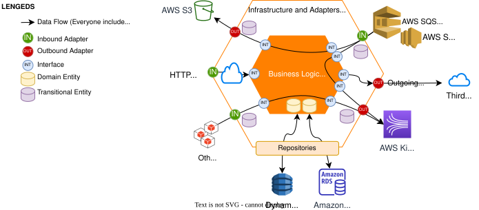

<div style="margin-bottom:15px">
<picture>
  <source media="(prefers-color-scheme: dark)" srcset="https://public-assets.wompi.com/images/wompi-logo-white.png">
  <source media="(prefers-color-scheme: light)" srcset="https://public-assets.wompi.com/images/wompi-logo-black.png">
  
</picture>
</div>

[](https://nestjs.com/)
[](https://nodejs.org)
[](https://www.npmjs.com/)
[](https://www.typescriptlang.org/)
[](https://github.com/google/gts)

# boilerplate-ms-nestjs

Base project for the implementation of microservices to be developed in [**NestJS**](https://docs.nestjs.com/), framework for building efficient and scalable server-side application.

- Each container microservice will be executed by **Docker** and Pods deployed through **AWS EKS**.
- Each container microservice will follow a [**Hexagonal Architecture**](https://blog.cleancoder.com/uncle-bob/2012/08/13/the-clean-architecture.html), **SOLID principles** and **Functional paradigm**.
- Each container microservice could follow the use of Reactive paradigm **RxJS**.
- With this structure we try to isolate business logic code without the intervention of specfic technologies like nest or cloud providers rather than basic typescript language.
- With this structure the goal is to reduce the amount of code and increase reuse
- With this structure the process of creating unit tests will be focusing on each specific layer (Infra and Domain), avoiding hard implementations for mocks or tests that need to instance whole business process, now we could test each module and function isolated.
- The goal is to increase the coverage of the business processes implemented.

The stack of technologies selected by Wompi are the following

- TypeScript with traspilation to JavaScript using **Node.js v24 LTS**
- Framework: **Nest.js 11.x.x**
- Unit testing: **Jest.js**
- Behaviour testing (optional): **Cypress.js**

<p align="center">
  
</p>

The repository structure to use is described below.

```
root
├── domain
│   ├── src
│   │   ├── common
│   │   │   ├── db-prefixes.vars.ts
│   │   │   └── domain-general.vars.ts
│   │   ├── interface
│   │   │   └── domain-database.repository.ts
│   │   ├── model
│   │   │   ├── database-generic-fields.type.ts
│   │   │   ├── domain.entity.ts
│   │   │   └── domain.type.ts
│   │   └── usecase
│   │       ├── get-feature.usecase.spec.ts
│   │       ├── get-feature.usecase.ts
│   ├── jest.config.js
├── src
│   ├── adapter
│   │   ├── in
│   │   │   ├── http
│   │   │   │   ├── api-domain.controller.spec.ts
│   │   │   │   ├── api-domain.controller.ts
│   │   │   │   ├── get-feature.pipe.spec.ts
│   │   │   │   └── get-feature.pipe.ts
│   │   │   └── sqs-listener
│   │   │       └── sqs.impl
│   │   └── out
│   │       ├── dynamodb
│   │       │   ├── client.ts
│   │       │   ├── domain-database.controller.spec.ts
│   │       │   ├── domain-database.controller.ts
│   │       │   ├── utils.spec.ts
│   │       │   └── utils.ts
│   │       ├── mongo
│   │       └── sqs-push
│   ├── handler
│   │   ├── get-feature.handler.spec.ts
│   │   └── get-feature.handler.ts
│   ├── model
│   │   ├── dto
│   │   │   ├── feature.type.ts
│   │   │   └── http-response.model.ts
│   │   ├── event
│   │   │   └── event.impl
│   │   ├── exceptions
│   │   │   └── custom.model.ts
│   │   ├── interfaces
│   │   │   ├── http-exception-response.interface.ts
│   │   │   ├── meta-response.interface.ts
│   │   │   └── response-code.interface.ts
│   │   └── mapper
│   │       ├── feature-entity.mapper.spec.ts
│   │       ├── feature-entity.mapper.ts
│   │       ├── feature.mapper.spec.ts
│   │       └── feature.mapper.ts
│   ├── common
│   │   ├── common.module.ts
│   │   ├── config
│   │   │   ├── env.validation.ts
│   │   │   ├── general.config.ts
│   │   │   └── health.controller.ts
│   │   ├── exceptions
│   │   │   └── exceptions-manager.filter.ts
│   │   ├── guards
│   │   │   └── cognito-auth.guard.ts
│   │   ├── interceptors
│   │   │   └── rest.interceptor.ts
│   │   ├── response-states
│   │   │   ├── error-states.messages.ts
│   │   │   └── success-states.messages.ts
│   │   ├── strategies
│   │   │   └── cognito.strategy.ts
│   │   └── utils
│   │       └── general.util.ts
│   ├── instance-domain.module.ts
│   ├── config.module.ts
│   ├── app.module.ts
│   └── main.ts
├── e2e
│   └── e2e.tests
├── jest.config.js
├── nest-cli.json
├── package-lock.json
├── package.json
├── sonar-project.properties
├── tsconfig.build.json
├── tsconfig.json
├── Dockerfile
└── README.md
```

CONSIDERATION:
The tests of the functions will be carried out in the same route where the logic or function is implemented. There is no test folder or it is created independently, which allows us to look in better detail at which functions do have test and which do not.

<p>
>
</p>

- **`domain/src`**: Folder that contains the DOMAIN layer or business logic and the use cases of the main where the source code of the repository rests. This layer is completely unaware of the infrastructure layer and should not reference any specific technologies. The use of this layer is given thanks to the consumption of the use cases and the implementation of the interfaces.
  - **`common`**: The files located here are common files or variables that are used in multiple interfaces or use cases. Only from the domain layer and for the domain layer.
  - **`interface`**: The interfaces described here generally allow you to absorb the implementation of the adapters or repositories from which you need to consume the usecases.
  - **`model`**: Flat classes that represent the proper entities embedded in the business logic.
  - **`usecase`**: In this folder will be the code functions that carry out the explicit procedure of the business logic, with the pure use of the language, making use of the interfaces corresponding to agents or adapters that the usecase consumes or uses. When making use of interfaces, they are unaware of the specific technologies with which they are implemented. Which allows abstraction and reuse in the event that a change in technology is required, which the infrastructure layer will take care of.

<p>
>
</p>

- **`src`**: Folder that contains the INFRASTRUCTURE layer or wrapper that knows the specific implementations of the technologies that this microservice will use, such as the Cloud provider, the Framework, the specific clients with specific brands.

  - **`adapter`**: The adapters are those that enable the entry to the system, Example: ApiAdapter.ts or QueueAdapter.ts, and there are 2 types, both input and output.
    - **`in`**: Input adapters are known because they are used by external actors that consume or use the services offered by this microservice. Ex: HTTP API endpoints, GRPC endpoints, consume messages with a Queue listener, among others.
    - **`out`**: Outbound adapters are known because they are used by the microservice itself, and they call or use external actors or resources. Example: When an HTTP API from a third party is consumed, it consumes an API from another microservice, sends asynchronous Queue push messages, Saves or queries from an FTP server, among others.
  - **`handler`**: They are the ones that actually manage the data received and sent from the adapters. The handler allows validating the DTOs, executing the corresponding mappers and consuming the specific Use Case.
  - **`model`**: The objects that allow communication between the actors that use the microservice and the use cases. Generally, the request and response of the HTTP endpoints are declared here, the events for Push/Subscribe messages and the mappers that allow the respective use cases of the domain/business logic layer to be consumed.
  - **`common`**: In this folder will be the common or transversal components of the application, such as configuration, utilities and constants.

  - `main.ts`: The app input file that is used by the NestFactory core function to create an instance of the Nest app.
  - `app.module.ts`: The root module of the application that allows to instantiate common and own objects of the server.
  - `instance-domain.module.ts`: The module of a domain implemented in the microservice that instantiates the use cases and adapters to use. It is recommended to update the name of this file for the implementation of the domain that is being carried out.

<p>
>
</p>

- **`e2e`**: This folder allows the creation of end to end tests and/or application behavior tests.

<p>
>
</p>

- `.env.template`: This file will contain the environment variables that will need to be injected to run the example project.
- `eslint.config.mjs`: This file will contain the lint configuration.
- `.gitignore`: Git file that indicates the files that should not be taken into account when versioning the repository
- `.nvmrc`: This file will contain the Node version to run this project.
- `.prettierrc.yaml`: This file will contain the formatter for JS/TS code.
- `Dockerfile`: In this file all the technical specifications for building a docker image will be declared.
- `.jest.config.js`: This file will contain the unit test and coverage configuration for JS/TS code.
- `.nest-cli.json`: This file will contain the NestJS configuration.
- `package.json`: File in which project properties are configured such as: name, version, dependencies, scripts, etc.
- `README.md`: This file must contain the technical description of the capabilities implemented or developed in the source code repository.
- `sonar-project.properties`: File that helps to define and configure the Sonar Cloud rules to not include files and/or folders in the coverage and analysis report.
- `tsconfig.json`: Configuration file that specifies the root files and compiler options needed to compile the project
- `tsconfig.build.json`: Configuration file that specifies the root files and compiler options needed to build the project

<p>
>
</p>

## Description

Checkout technical challenge microservice. Implements a public `GET /products` endpoint that lists products stored in Postgres (via TypeORM), with pagination and optional filtering by name and price range.

## Products endpoint

`GET /products` returns a paginated list of products. It is a public endpoint (no authentication required).

Query parameters (all optional):

| Parameter  | Type   | Default | Description                                  |
| ---------- | ------ | ------- | --------------------------------------------- |
| `page`     | number | `1`     | Page number (1-based)                         |
| `pageSize` | number | `10`    | Items per page (max `100`)                    |
| `name`     | string | -       | Filters products whose name contains the text |
| `minPrice` | number | -       | Minimum price in cents (inclusive)            |
| `maxPrice` | number | -       | Maximum price in cents (inclusive)            |

`price` is always an integer expressed in cents (e.g. `100000` = `$1,000.00`), both in the database and in the API response — there is no decimal conversion at any layer.

Example request:

```bash
curl 'http://localhost:3000/products?page=1&pageSize=5&name=headphones&minPrice=10000&maxPrice=5000000'
```

Example response:

```json
{
  "status": 200,
  "meta": {"trace_id": "..."},
  "code": "OK",
  "message": "Solicitud ejecutada correctamente.",
  "data": {
    "items": [
      {
        "id": "11111111-1111-1111-1111-111111111101",
        "name": "Wireless Bluetooth Headphones",
        "description": "Over-ear wireless headphones with active noise cancellation and 30-hour battery life.",
        "price": 24999900,
        "stock": 120,
        "image": "https://images.example.com/products/wireless-headphones.jpg",
        "createdAt": "2024-01-01T00:00:00.000Z",
        "updatedAt": "2024-01-01T00:00:00.000Z"
      }
    ],
    "page": 1,
    "pageSize": 5,
    "total": 1,
    "totalPages": 1
  }
}
```

### Database setup

The `products` table and its seed data are managed with TypeORM migrations (not `synchronize`). To set up a local Postgres instance:

```bash
# 1. Start Postgres (and localstack) via docker-compose
docker compose up -d postgres

# 2. Run pending migrations (creates the table and inserts 10 seed products)
npm run migration:run

# 3. Check migration status
npm run migration:show

# 4. Revert the last migration if needed
npm run migration:revert
```

Additional migration scripts:

```bash
# Generate a migration from entity changes
npm run migration:generate -- src/common/migrations/MigrationName

# Scaffold an empty migration file
npm run migration:create -- src/common/migrations/MigrationName
```

## Installation

```bash
# installation
$ npm install
```

## Environment variables

Copy `.env.template` to `.env` and fill in the values for your environment (see `.env.template` for the full list, including `DB_HOST`, `DB_PORT`, `DB_USERNAME`, `DB_PASSWORD`, `DB_NAME` and `DB_AUTH_MECHANISM` used by the Postgres/TypeORM connection).

## Running the app

```bash
# build
$ npm run build

# development
$ npm run start

# watch mode
$ npm run start:dev

# debug mode
$ npm run start:debug

# production mode
$ npm run start:prod

```

## Test

```bash
# unit tests
$ npm run test

# unit tests with watch
$ npm run test:watch

# unit tests with coverage
$ npm run test:cov

# unit tests debug mode
$ npm run test:debug

# e2e tests
$ npm run test:e2e

# e2e tests with coverage
$ npm run test:e2e-cov
```

## Support

Whole software is owned and licensed only and by WOMPI S.A.S.

It can grow thanks to the Wompi Development team and Wompi Support.
