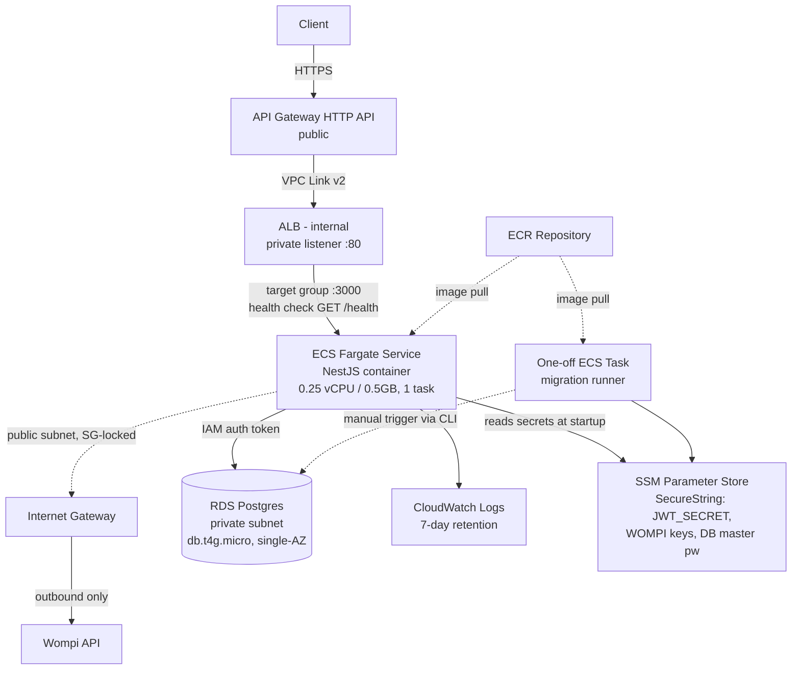

# AWS Deployment Plan (Terraform) — Checkout NestJS API

This folder contains the implementation plan for deploying the `server/` NestJS
application to AWS using Terraform, split into 4 sequential epics.

## Architecture

## Requirements summary

- ECS Fargate (0.25 vCPU/0.5GB, 1 task, no autoscaling) running the existing Docker image
- API Gateway HTTP API (public) -> VPC Link v2 -> private ALB -> ECS Fargate, catch-all proxy route (`ANY /{proxy+}`)
- New VPC, ECS tasks in **public** subnets (no NAT Gateway) with public IPs, locked down via security groups
- RDS Postgres, single-AZ, `db.t4g.micro`, in **private** subnets
- IAM database authentication for the app's runtime DB connection (matches `AuthMechanism.IAM_AUTH` in code); master password only used for bootstrap/migrations, stored in SSM Parameter Store (SecureString)
- ECR repository, Terraform-managed; image build/push is a separate manual step
- App secrets (JWT_SECRET, WOMPI_* keys) in SSM Parameter Store (SecureString)
- CloudWatch Logs for ECS task stdout/stderr, 7-day retention
- DB migrations run via a one-off ECS Fargate task, triggered manually via `aws ecs run-task`
- Local Terraform state (no S3 backend)
- Single environment, clean AWS account, no existing resources/domain/cert

## Key research findings

- API Gateway HTTP API VPC Link v2 supports **direct integration with an ALB listener** — no NLB
  intermediary needed (AWS Serverless Land reference pattern `apigw-vpclink-pvt-alb-terraform`).
- RDS **always** requires a master username/password at creation, even with
  `iam_database_authentication_enabled = true`. IAM auth is granted per-DB-user
  (`GRANT rds_iam TO app_user`) on top of that.
- The app exposes `GET /health` (no global prefix), listens on `PORT` env var (default 3000).
- The app already branches on `AuthMechanism.IAM_AUTH` vs `PASSWORD` in `typeorm.config.ts`
  and depends on `@aws-sdk/rds-signer` — IAM auth is genuinely implemented, not just scaffolded.

## Epics

1. [`epic-1-networking-security/PLAN.md`](./epic-1-networking-security/PLAN.md) — VPC, subnets, route tables, security groups.
2. [`epic-2-data-secrets/PLAN.md`](./epic-2-data-secrets/PLAN.md) — RDS, ECR, SSM secrets, ECS execution role.
3. [`epic-3-compute/PLAN.md`](./epic-3-compute/PLAN.md) — ECS task definition, migrations, ECS service + ALB.
4. [`epic-4-public-ingress-docs/PLAN.md`](./epic-4-public-ingress-docs/PLAN.md) — API Gateway + VPC Link, docs, teardown.

Each epic's first task is a **handoff check**: a set of AWS CLI commands that verify the
previous epic's resources actually exist and are correctly configured before any new
resources are provisioned. Do not proceed past a failed handoff check.
